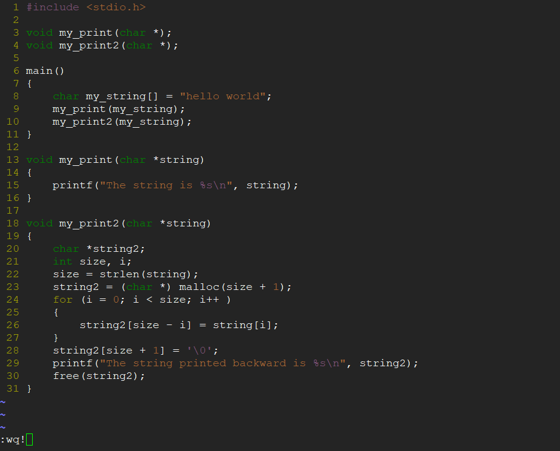

# 实验一　环境及基本操作实验
-----
### 一、实验目的
熟悉Unix或Linux系统环境。
掌握Unix或Linux系统环境下的基本操作命令。

-----

### 二、实验内容
掌握Unix的基本操作命令
使用vi编辑器

-----

### 三、实验步骤
#### 1、登录和退出
<1> 登录服务器系统;
<2> 在login:后输入用户帐号;
<3> 登录后，输入passwd命令来修改密码。根据提示输入当前密码，再输入两次新的密码。
<4> 输入logout命令或exit命令退出系统。


#### 2、获取帮助信息
命令man提供了系统操作命令的在线帮助。例如，输入man passwd 可以获取命令passwd的帮助说明；输入man 2 open 可以获取open 函数的帮助说明。按空格键，翻页浏览。按<shift><:>，再按q退出帮助。 


#### 3、基本操作命令
<1> pwd:确定你当前的工作目录
<2> ls:显示当前工作目录的内容
<3> mkdir:建立一个子目录
<4> cd:转换目录
<5> cat或more：查看文件内容
<6> cp：复制文件
<7> rm:删除文件
<8> mv:重命名文件
<9> find:查找文件
各个命令的具体使用方法，可以用man命令查看。


#### 4、vi编辑器
vi编辑器是一个小巧但功能强大的程序。vi编辑器有三种不同的模式：

1. 插入模式——这个模式是通过在命令模式按下“i”键进入的。

2. 命令模式——这是用户输入单键命令的模式。在其他模式中按下ESC键就可以进入命令模式。常见的执行删除操作的命令有：
    * dd    删除整个行
    * #dd   按照输入的数字（＃），从当前行删除几行
    * D     删除光标位置后面全部内容
    * dw    删除光标所在位置的单词

3. 冒号模式——从命令模式输入一个冒号（：）就可以进入这个模式。常见的冒号模式命令有：
    * ：wq 保存且退出编辑器
    * ：w  保存但不退出
    * ：q   退出且不保存
    * ：q!  强行退出vi，不保存。
    * ：help 获取帮助

1）	在系统提示符（$）下输入命令vi和想要编辑（建立）的文件名  vi test.c <enter>
2）	按键I进入插入模式。屏幕上看不到字符i，屏幕下方出现--INSERT--字样。
3）	输入你的程序：

```
/*********************************************************************
#include <stdio.h>

void my_print(char *); 
void my_print2(char *); 

main ()
{ 
    char my_string[] = "hello world";
    my_print (my_string); 
    my_print2 (my_string);
}

void my_print(char *string)
{
    printf("The string is %s\n", string);
}

void my_print2(char *string)
{ 
    char *string2; 
    int size, i;  
    size = strlen (string); 
    string2 = (char *) malloc (size + 1); 
    for (i = 0; i < size; i++) 
    {   
        string2[size - i] = string[i];
    }   
    string2[size + 1] = '\0';
    printf ("The string printed backward is %s\n", string2); 
    free(string2);
}
```
4）按〈Esc〉键，从插入模式进入冒号模式。
5）输入wq，保存退出。



### 四、总结
* 问题：在使用passwd更改密码的时候，由于使用的密码是123456以至于少于8位数太过简单，fedora系统不让更改成功。
* 方法：按照系统提示改成8位数即可，如12345678。
* 以前基本操作过这些命令，所以基本上没什么问题。
