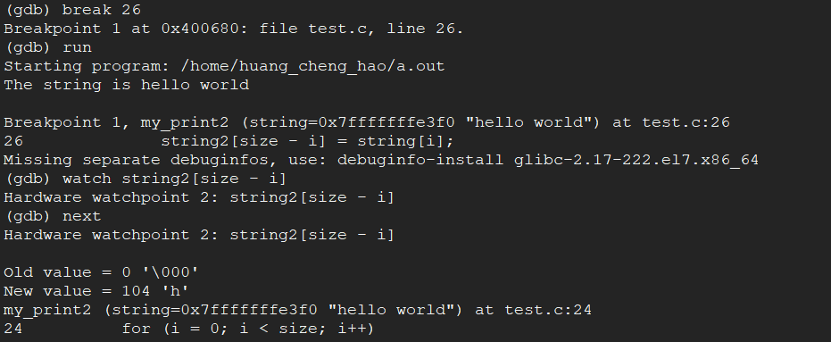
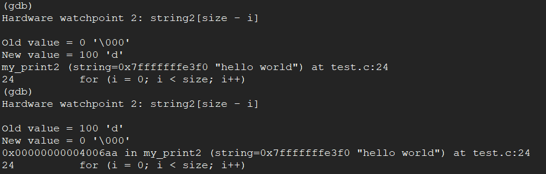

# 实验二　命令解释程序的使用

### 一、实验目的
掌握UNIX或LINUX环境下命令解释程序的使用
能对编写简单的C程序，进行编译运行和调试。 

-----

### 二、实验内容
输入LINUX相关命令后记录系统输出
简单的C程序，进行编译运行和调试

-----

### 三、实验步骤

#### 1、命令操作

1)	浏览目录和文件的各种属性 ls –l、
2)	显示文件内容 cat、more、
3)	改变文件和目录的权限chmod、
4)	显示当前目录 pwd、
5)	文字统计 wc、
6)	查看时间命令 date 、time、
7)	帮助命令 help、
8)	查看与删除进程命令ps,  kill、
9)	查看在线用户 who


#### 2、GNU gcc
*GCC 是GNU提供的C 和C++ 编译器。实际上，GCC 能够编译三种语言：C、C++ 和Object C（C 语言的一种面向对象扩展）。利用gcc命令可同时编译并连接C 和C++ 源程序。如果你有两个或少数几个C 源文件，也可以方便地利用GCC 编译、连接并生成可执行文件。*
* **gcc 命令的基本用法如下：**
` gcc [options] [filenames]`
* **gcc的主要选项：**
```
	-ansi           只支持ANSI 标准的C语法。这一选项将禁止GNU C的某些特色，例如asm 或typeof 关键词。
	-c              只编译并生成目标文件。
	-DMACRO         以字符串“1”定义MACRO 宏。
	-DMACRO=DEFN    以字符串“DEFN”定义MACRO 宏。
	-E              只运行C 预编译器。
	-g              生成调试信息。GNU 调试器可利用该信息。
	-IDIRECTORY     指定额外的头文件搜索路径DIRECTORY。
	-LDIRECTORY     指定额外的函数库搜索路径DIRECTORY。
	-lLIBRARY       连接时搜索指定的函数库LIBRARY。
	-m486           针对486 进行代码优化。
	-o FILE         生成指定的输出文件。用在生成可执行文件时。
	-O0             不进行优化处理。
	-O 或-O1        优化生成代码。
	-O2             进一步优化。
	-O3             比-O2 更进一步优化，包括inline 函数。
	-shared         生成共享目标文件。通常用在建立共享库时。
	-static         禁止使用共享连接。
	-UMACRO         取消对MACRO 宏的定义。
	-w              不生成任何警告信息。
	-Wall           生成所有警告信息。
```

<1> 输入gcc test.c
<2> 输入ls查看，目录下应该有个a.out文件
<3> 输入./a.out，运行程序，屏幕上显示
```
The string is hello world
The string printed backward is
```

<4> 如果想给程序重命名，使用编译选项-o重新编译。输入gcc –o test test.c
<5> 输入ls查看，目录下应该有个test文件
<3> 输入 ./test，运行程序
这个程序执行时显示如下结果：
``` 
The string is hello world
The string printed backward is
```
输出的第一行是正确的，但第二行打印出的东西并不是我们所期望的。我们所设想的输出应该是： The string printed backward is dlrow olleh。由于某些原因，my_print2 函数没有正常工作。下面让我们用gdb 看看问题究竟出在哪儿。

#### 3、GNU gdb
*gdb 是一个用来调试C 和C++ 程序的强力调试器。以下是gdb 所提供的一些功能：它使你能监视你程序中变量的值；它使你能设置断点以使程序在指定的代码行上停止执行；它使你能一行行的执行你的代码。* 在命令行上键入gdb并按回车键就可以运行gdb 了。
>**gdb 的常用命令：
File 装入想要调试的可执行文件。
List 列出产生执行文件的源代码的一部分。
Run 执行当前被调试的程序。
Break 在代码里设置断点，这将使程序执行到这里时被挂起。
Next 执行一行源代码但不进入函数内部。
Step 执行一行源代码而且进入函数内部。
Watch 使你能监视一个变量的值而不管它何时被改变。
Print 使你能查看变量值。
Kill 终止正在调试的程序。
Quit 终止gdb。**

<1>加入调试编译选项-ggdb，重新编译。输入gcc -ggdb -o test test.c
<2>输入命令gdb进入调试环境。
<3>在gdb 命令行提示符下键入file test，装入程序。屏幕显示：
```
Reading symbols from test...done.
```

<4>输入命令run，运行程序。屏幕显示：
```
Starting program: /home/zjh/test
The string is hello world
The string printed backward is
    
Program exited with code 040.
```

<5>输入命令list，显示程序代码
```
1       #include <stdio.h>
2
3       void my_print(char *);
4       void my_print2(char *);
5
6       main()
7       {
8         char my_string[] = "hello world";
9         my_print(my_string);
10        my_print2(my_string);  
```
再输入命令list，显示后续的程序代码。

<6>输入break 26，屏幕显示
```
Breakpoint 1 at 0x80485a0: file test.c, line 26.
```
<7>输入run,屏幕显示
```
Starting program: /home/zjh/test
The string is hello world

Breakpoint 1, my_print2 (string=0xbffffa40 "hello world") at test.c:26
26	string2[size - i] = string[i];
```
<8> watch string2[size-i]，屏幕显示
```
Watchpoint 2: string2[size - i]
```
<9>输入next，程序运行了第26行，屏幕显示
```
Watchpoint 2: string2[size - i]
    
Old value = 0 '\000'
New value = 104 'h'
my_print2 (string=0xbffffa40 "hello world") at test.c:24
24        for (i = 0; i < size; i++)   
```

<10> 在gdb 提示符下按回车键将重复上一个命令。
<11> 通过跟踪可以发现，当i=10 时，表达式string2[size - i] 的值等于‘d‘，size-i的值等于1，最后一个字符已经拷到新串里了。如果你再把循环执行下去，你会看到已经没有值分配给string2[0] 了，而它是新串的第一个字符，因为malloc函数在分配内存时把它们初始化为空(null)字符。所以string2 的第一个字符是空字符。这解释了为什么在打印string2 时没有任何输出了。

<12> 现在找出了问题出在第26行，改正程序，重新编译运行。正确结果如下：  
```
The string is hello world
The string printed backward is dlrow olleh
```


修改后test.c的完整代码如下：

#### 4、GNU make
*在大型的开发项目中，通常有几十到上百个的源文件，如果每次均手工键入gcc 命令进行编译的话，则会非常不方便。因此，人们通常利用make 工具来自动完成编译工作。这些工作包括：如果仅修改了某几个源文件，则只重新编译这几个源文件；如果某个头文件被修改了，则重新编译所有包含该头文件的源文件。利用这种自动编译可大大简化开发工作，避免不必要的重新编译。实际上，make工具通过一个称为makefile 的文件来完成并自动维护编译工作。makefile需要按照某种语法进行编写，其中说明了如何编译各个源文件并连接生成可执行文件，并定义了源文件之间的依赖关系。当修改了其中某个源文件时，如果其他源文件依赖于该文件，则也要重新编译所有依赖该文件的源文件。*

**makefile文件**是许多编译器，包括Windows NT下的编译器维护编译信息的常用方法，只是在集成开发环境中，用户通过友好的界面修改makefile 文件而已。默认情况下，GNU make 工具在当前工作目录中按如下顺序搜索makefile：
* GNUmakefile
* makefile
* Makefile

在UNIX 系统中，习惯使用Makefile 作为makfile 文件。如果要使用其他文件作为makefile，则可利用类似下面的make 命令选项指定makefile 文件：
```
$ make -f  Makefile.debug
```
makefile 中一般包含如下内容：
1. 需要由make 工具创建的项目，通常是目标文件和可执行文件。通常使用“目标（target）”一词来表示要创建的项目。
2. 要创建的项目依赖于哪些文件。
3. 创建每个项目时需要运行的命令。

例如，假设你现在有一个C++ 源文件test.C，该源文件包含有自定义的头文件test.h，
则目标文件test.o 明确依赖于两个源文件：test.C 和test.h。另外，你可能只希望利用g++
命令来生成test.o 目标文件。这时，就可以利用如下的makefile 来定义test.o 的创建规则：
```
# This makefile just is a example.
# The following lines indicate how test.o depends
# test.C and test.h, and how to create test.o
test.o: test.C test.h
g++ -c -g test.C
```
从上面的例子注意到，第一个字符为# 的行为注释行。第一个非注释行指定test.o 为目标，并且依赖于test.C 和test.h 文件。随后的行指定了如何从目标所依赖的文件建立目标。当test.C 或test.h 文件在编译之后又被修改，则make 工具可自动重新编译test.o，如果在前后两次编译之间，test.C 和test.h 均没有被修改，而且test.o 还存在的话，就没有必要重新编译。这种依赖关系在多源文件的程序编译中尤其重要。通过这种依赖关系的定义，make 工具可避免许多不必要的编译工作。当然，利用Shell 脚本也可以达到自动编译的效果，但是，Shell 脚本将全部编译任何源文件，包括哪些不必要重新编译的源文件，而make 工具则可根据目标上一次编译的时间和目标所依赖的源文件的更新时间而自动判断应当编译哪个源文件。一个makefile 文件中可定义多个目标，利用make target 命令可指定要编译的目标，如果不指定目标，则使用第一个目标。通常，makefile 中定义有clean 目标，可用来清除编译过程中的中间文件，例如：
```
clean:
    rm -f *.o
```
运行make clean 时，将执行rm -f *.o 命令，最终删除所有编译过程中产生的所有中间文件。

**makefile 变量：**
*GNU 的make 工具除提供有建立目标的基本功能之外，还有许多便于表达依赖性关系以及建立目标的命令的特色。其中之一就是变量或宏的定义能力。如果你要以相同的编译选项同时编译十几个C 源文件，而为每个目标的编译指定冗长的编译选项的话，将是非常乏味的。但利用简单的* **变量定义** *，可避免这种乏味的工作：*
```
# Define macros for name of compiler
CC = gcc
# Define a macr o for the CC flags
CCFLAGS = -D_DEBUG -g -m486
# A rule for building a object file
test.o: test.c test.h
$(CC) -c $(CCFLAGS) test.c
```
在上面的例子中，CC 和CCFLAGS 就是make 的变量。GNU make 通常称之为变量，而其他UNIX 的make 工具称之为宏，实际是同一个东西。在makefile 中引用变量的值时，只需变量名之前添加`$` 符号，如上面的`$(CC) `和`$(CCFLAGS)`。

任务：假设你有两个源文件main.c 和factorial.c 两个源文件，现在要编译生成一个计算阶乘的程序。

```c
// factorial.c
int factorial(int n) {
    if (n <= 1)  
        return 1;
    else 
        return factorial(n - 1)*n;
}

```
```c
// main.c
int factorial(int n);
int main(int argc, char **argy){
    int n;
    if(argc < 2){
        printf("Usage:%s n\n", argy[0]);
        return -1;
    }
    else {
        n = atoi(argy[1]);
        printf("Factorial of %d is %d.\n", n, factorial(n));
    }
    return 0;
}
```

请编写出编译程序factorial 的makefile，并编译。
* Makefile文件的内容如下：

* 编译执行


-----

### 四、总结
* 问题：在使用watch string[size – i]命令设置观察点时，fedora上使用info watchpoints时虽然也显示也设置了观察点，但是当值改变时，gdb却没显示出来。
* 方法：换另一个环境运行调试，比如centos7.3等等
