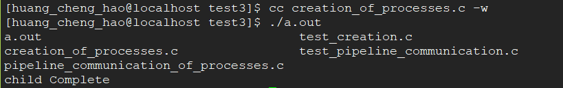
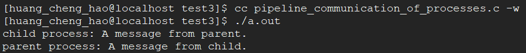
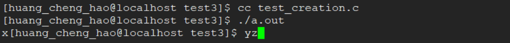
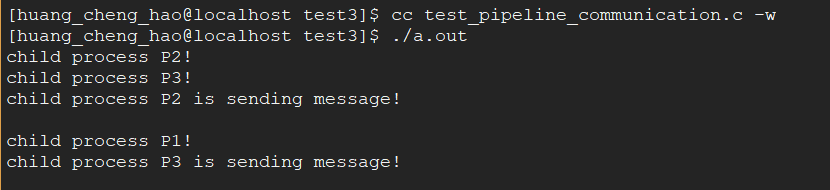

# 实验三    进程管理实验

## 一、实验目的

- 了解有关Linux系统调用。
- 学习有关Linux的进程创建，理解进程创建后两个并发进程的执行。
- 加深对进程概念的理解，明确进程和程序的区别。

-----

## 二、实验内容

1. **进程的创建：**
在Linux环境下，编写一个程序使用系统调用`fork()`创建2个子进程。当此子进程运行时，在系统中由一个父进程和两个子进程活动。让每个进程在屏幕上显示一个字符；父进程显示字符`'x'`，子进程分别显示`'y'`和`'z'`。试记录屏幕上的显示结果，并分析原因。

2. **进程的管道通信：**
编写一个程序使用系统调用`fork()`生成3个子进程，并使用系统调用`pipe()`创建一个管道，使得这3个子进程和父进程公用同一管道进行信息通信要求该程序实现数据的输入、输出以及信息提示。

-----

## 三、实验原理(LINUX系统调用)

1. **进程控制的系统调用**
>**1）fork系统调用创建新的子进程**
格式：`pid = int fork()`
`fork`调用返回时，系统中已有两个用户级环境完全相同的进程存在，这两个进程从`fork`调用中得到的返回值不同，其中子进程得到的返回值为零，父进程得到的返回值是新创建子进程的进程标识号。

>**2）exec系统调用**
格式：(六种）
`int execl(path,arg0,arg1,…,argn)`
`char *path, *arg0, *arg1, …, *argn ;`
`exec`调用进程的正文段被指定的目标文件的正文段所覆盖，其属性的变化方式与`fork`成功后从父进程那里继承属性的方式几乎是一样的。系统中绝大多数命令都是通过`exec`来执行的，不但shell进程所创建的子进程使用它来执行用户命令，shell进程本身和它的祖先进程也是用`exec`来启动执行的。

>**3) exit 系统调用终止进程执行**
格式：`void exit(status)`
`int status ;`
参数`status`是调用进程终止时传递给其父进程的值。如调用进程还有子进程，则将其所有子进程的父进程改为1号进程。

>**4) wait 系统调用等待子进程暂停或终止**
格式：`int wait(stat_loc)`
`int stat_loc ;`
`wait`调用将调用进程挂起，直到该进程收到一个被其捕获的信号或者它的任何一个子进程暂停或终止为止。如果`wait`调用之前已有子进程暂仃或终止，则该调用立即返回。

>**5) lockf 锁定文件**
格式：`int lockf(fd,fuction,size)`
`int files, fuction; long size;` 
`fd` -- 锁定文件标识
`function` -- 为0表示不锁定，1表示锁定，2表示测试和锁定，3表示测试有否被锁定
`size` -- 锁定或解锁的字节数，0表示从文件的当前位置到文件尾。


*进程创建程序*
```
//-- creation_of_processes.c
#include <stdio.h>
#include <unistd.h>

void main (int argc, char *argv[]) {
    int pid;
    pid = fork();   /* fork child process */
    if (pid < 0) {
        fprintf(stderr, "Fork Failed\n"); 
        exit(-1);
    } else if (pid == 0) {
        execlp("/bin/ls", "ls", NULL);
    } else {    /* child process */
        wait(NULL);
        printf("child Complete\n");
        exit(0);
    }
    /* parent process */
}
```



**2.进程通信的系统调用**
>**1)pipe系统调用**
格式： `int pipe (filedes)`
`int filedes [2]；`

*管道通信程序*
```
//-- pipeline_communication_of_processes.c
#include <stdio.h>
#include <unistd.h>

char parent[] = "A message from parent.";
char child[] = "A message from child.";

void errexit(const char *s) {
    printf(s);
    exit(1);
}

int main () {
    int chan1[2], chan2[2];
    char buf[100];
    if (-1 == pipe(chan1) || -1 == pipe(chan2) ) {
        errexit("pipe\n");
    }
    if (fork()) {
        close(chan1[0]);
        close(chan2[1]);
        write(chan1[1], parent, sizeof(parent));
        close(chan1[1]);
        read(chan2[0], buf, 100);
        printf("parent process: %s \n", buf);
        close(chan2[0]);
    } else {
        close(chan1[1]);
        close(chan2[0]);
        read(chan1[0], buf, 100);
        printf("child process: %s \n", buf);
        write(chan2[1], child, sizeof(child));
        close(chan2[1]);
        close(chan1[0]);
    }
    return 0;
}
```



-----

## 四、实验程序

**1、进程的创建**
```
//-- test_creation.c
#include <stdio.h>

int main () {
    int p1, p2; 
    p1 = fork();
    //while (p1 == fork() == -1);
    if (p1 == 0) { 
        putchar('y');
    } else {
        p2 = fork();
        //while (p2 == fork() == -1);
        if (p2 == 0) {
            putchar('z');
        } else {
            putchar('x');
        }   
    }   
    return 0;
}
```



**2、进程的管道通信**
```
//-- test_pipeline_communication.c
#include <unistd.h>
#include <stdio.h>

int main() {
    int I, r, p1, p2, p3, fd[2];
    char Outpipe[50], Inpipe[5];
    pipe(fd);
    p1 = fork();
    //while (p1 == fork());
    if (p1 == 0) {
        lockf(fd[1], 1, 0);
        sprintf(Outpipe, "child process P1 is sending message!\n");
        printf("child process P1!\n");
        write(fd[1], Outpipe, 50);
        sleep(5);
        lockf(fd[1], 0, 0);
        exit(0);
    } else {
        p2 = fork();
        // while(p2 == fork() == -1);
        if (p2 == 0) {
            lockf(fd[1], 1, 0);
            sprintf(Outpipe, "child process P2 is sending message!\n");
            printf("child process P2!\n");
            write(fd[1], Outpipe, 50);
            sleep(5);
            lockf(fd[1], 0, 0);
            exit(0);
        } else {
            p3 = fork();
            // while(p3 == fork() == -1);
            if (p3 == 0) {
                lockf(fd[1], 1, 0);
                sprintf(Outpipe, "child process P3 is sending message!\n");
                printf("child process P3!\n");
                write(fd[1], Outpipe, 50);
                sleep(5);
                lockf(fd[1], 0, 0);
                exit(0); 
            }
        }
        wait(0);
        if (r = read(fd[0], Inpipe, 50) == -1) {
            printf("can't read pipe\n");
        } else {
            printf("%s\n", Inpipe);
        }
        wait(0);
        if (r = read(fd[0], Inpipe, 50) == -1) {
           printf("can't read pipe\n"); 
        } else {
            printf("%s\n", Inpipe);
        }
        exit(0);
    } 
    return 0;
}
```



-----

## 五、实验报告要求

* 问题：在程序运行中，程序一经调用就完成，不好体会系统调用。

* 方法：改用 gdb 进行单步调试，并在 gdb 中使用 shell ps 命令等进行加深理解进程等概念。 

