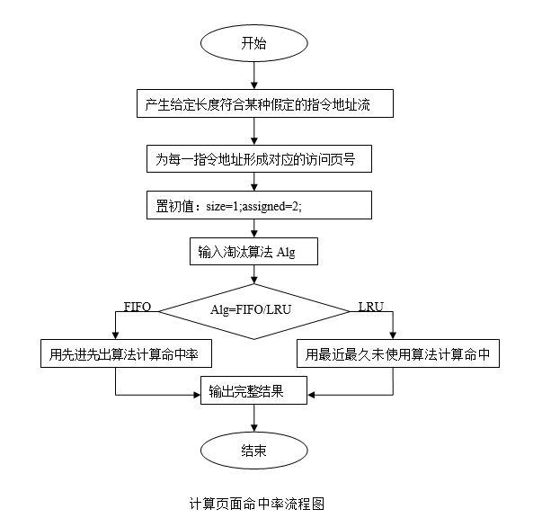

# 实验四：存储管理实验

### 一、实验目的

使用C语言编写页式分配存储算法的模拟程序，了解虚拟存储技术的特点，掌握请求式页式存储管理的页面置换算法。并通过分析计算FIFO页面淘汰算法情况下的访问命中率。

-----

### 二、实验内容

设计一个虚拟存储区和内存工作区，并使用最近最少使用算法计算访问命中率。
命中率＝（1－页面失效次数）/页地址流长度。

-----

### 三、实验原理

#### 1、通过Srand()和rand()函数定义和产生一个指令序列共320条指令，然后将指令序列变换成相应的页地址流。
（1）指令的地址按下述原则生成。
* 50％的指令四顺序执行的。
* 25％的指令是均匀分布在前地址部分。
* 25％的指令是均匀分布在后地址部分。

（2）具体的实施方法：
* 在[0,319]的指令地址之间随机选取一起点m;
* 顺序执行一条指令，即执行地址为m+1的指令。
* 在前地址[0,m+1]中随机选取一条指令并执行，该指令的地址为m’。
* 顺序执行一条指令，其地址为m’＋1；
* 在后地址[m’+2,319]中随机选取一条指令执行。
* 重复上述步骤，直到执行320次指令。

#### 2、将指令序列变换成页地址流
设：页面大小为1K，用户内存容量为4页到32页，用户虚存容量为32K。在用户虚存中，按每K存放10条指令排列虚存地址。按以上方式，用户指令可组成32页。

#### 3、流程图

 

#### 4、数据结构

（1）页面类型

```
    typedef struct {
        int pn;         // 页号
        int pfn;        // 面号
        int counter;    // 一个周期内访问该页面次数
        int time;       // 访问时间
    } pl_type;
```

（2）页面控制结构

```
    struct pfc_struct {
        int pn, pfn;
        struct pfc_struct *next;
    };
    typedef struct pfc_struct pfc_type;
    pfc_type pfc[total_vp]; // 定义用户进程虚页控制结构
    pfc_type *freepf_head;  // 空页面头的指针
    pfc_type *busypf_head;  // 忙页面头的指针
    pfc_type *busypf_tail;  // 忙页面尾的指针
```

#### 5、函数定义

```
    int initialize (int total_pf);  // 初始化函数，给每个相关的页面赋值
    void FIFO (int total_pf);       // 计算使用FIFO算法时的命中率
    void LRU (int total_pf);
```

#### 6、变量定义
```
    int a[total_instruction];       // 指令数据组
    int page[total_instruction];    // 每条指令所属页号
    int offset[total_instruction];  // 每页装入10条指令后取模运算页号偏移值
    int total_pf;                   // 用户进程的内存页面数
    int disaffect;                  // 页面失效次数
```

#### 7、FIFO实验部分程序

```
#include <sys/types.h>
#include <stdlib.h>
#include <unistd.h>
#include <stdio.h>

#define TRUE 1
#define FALSE 0
#define INVALID -1
#define null 0

#define total_instruction 320
#define total_vp 32
#define clear_period 50

// 页面类型
typedef struct {
    int pn;         // 页号
    int pfn;        // 面号
    int counter;    // 一个周期内访问该页面次数
    int time;       // 访问时间
} pl_type;

pl_type pl[total_vp];

// 页面控制结构
struct pfc_struct {
    int pn, pfn;
    struct pfc_struct *next;
};
typedef struct pfc_struct pfc_type;
pfc_type pfc[total_vp]; // 定义用户进程虚页控制结构
pfc_type *freepf_head;  // 空页面头的指针
pfc_type *busypf_head;  // 忙页面头的指针
pfc_type *busypf_tail;  // 忙页面尾的指针

int initialize (int total_pf);  // 初始化函数，给每个相关的页面赋值
void FIFO (int total_pf);       // 计算使用FIFO算法时的命中率
void LRU (int total_pf);

int a[total_instruction];       // 指令数据组
int page[total_instruction];    // 每条指令所属页号
int offset[total_instruction];  // 每页装入10条指令后取模运算页号偏移值
int total_pf;                   // 用户进程的内存页面数
int disaffect;                  // 页面失效次数

int main () {
    int S, i, j;
    srand(getpid()*10);
    S = (float)319*rand()/32767 + 1;
    for (i = 0; i < total_instruction; i += 2) {
        a[i] = S;
        a[i + 1] = a[i] + 1;
        a[i + 2] = (float)a[i]*rand()/32767;
        a[i + 3] = a[i + 2] + 1;
        S = (float)rand()*(318 - a[i + 2]/32767) + a[i + 2] + 2;
    }
    for (i = 0; i < total_instruction; i++) {
        page[i] = a[i]/10;
        offset[i] = a[i]%10;
    }
    for (i = 4; i < 32; i++) {
        printf("%2d page frames", i);
        FIFO(i);
        LRU(i);
        printf("\n");
    }
    return 0;
}

void FIFO(int total_pf) {
    int i, j;
    pfc_type *p, *t;
    initialize(total_pf);
    busypf_head = busypf_tail = NULL;
    for (i = 0; i < total_instruction; i++) {
        if (pl[page[i]].pfn == INVALID) {
            disaffect += 1;
            if (freepf_head == NULL) {
                p = busypf_head->next;
                pl[busypf_head->pn].pfn = INVALID;
                freepf_head->next = NULL;
                busypf_head = p;
            }
            p = freepf_head->next;
            freepf_head->next = NULL;
            freepf_head->pn = page[i];
            pl[page[i]].pfn = freepf_head->pfn;
            if (busypf_tail == NULL) {
                busypf_head = busypf_tail = freepf_head;
            } else {
                busypf_tail->next = freepf_head;
            }
            busypf_tail = freepf_head;
        }
        freepf_head = p;
        printf("FIFO:%6.4f", 1-(float)disaffect/320);
    }
}
```
-----

### 四、实验要求

1．用C编制LRU（最近最久未使用调度算法）。
2．进行编译运行和调试。
3．分析运行结果。
4．体会

