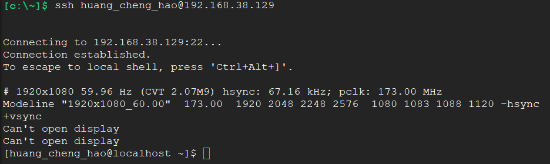
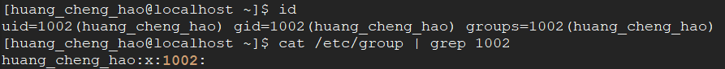
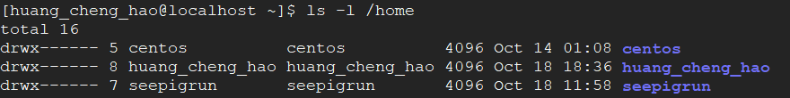
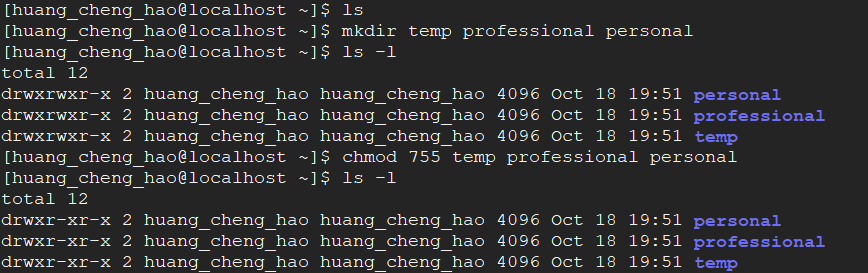
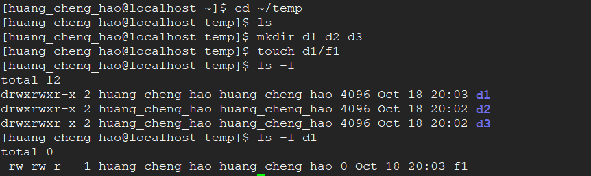
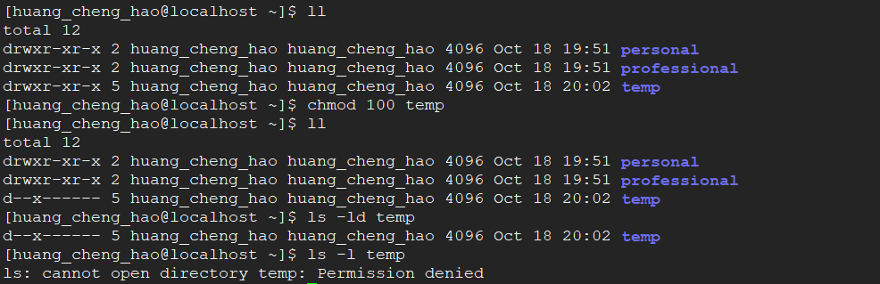
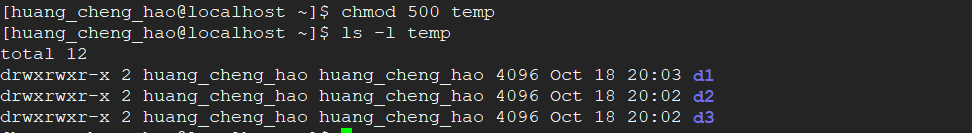
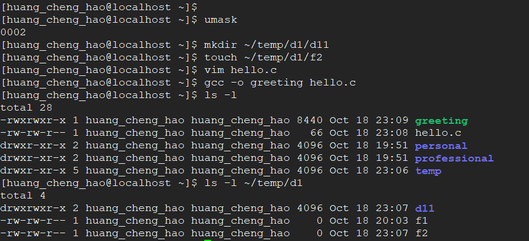
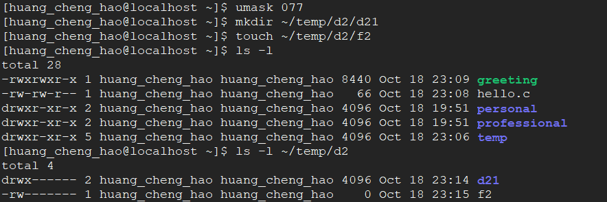
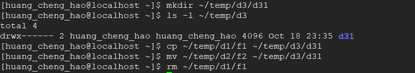

# 实验五 文件系统实验

### 一、实验目的

1. 学习Linux的文件访问权限，用户的类型和文件访问权限的类型；
2. 学习如何确定一个文件的访问权限；
3. 学习如何设置和改变一个文件的访问权限；
4. 学习如何在文件或目录的创建时设置缺省访问权限；
5. 学会如何显示文本文件的内容。

-----

### 二、实验内容
实验使用的命令有：`finger`、`cd`、`mkdir`、`ls`、`chmod`、`touch`、`umask`等

-----

### 三、实验原理
1. 在Linux系统中，一个文件的用户类型有三种：
    - 所有者（ owner users ）
    - 组（ group users）
    - 其他人（ Other users ）

2. Linux系统中，文件有三种访问权限：
    - 读(r)--允许读某个文件；
    - 写(w) --允许写、修改和删除某个文件；
    - 执行(x) --允许执行(run)某个文件。

3. 对于一个目录而言：
    - 读(r) --允许用户列出目录的内容，使用`ls`命令；
    - 写(w) --允许用户在目录下建立新文件，删除子目录和文件；
    - 执行(x) --允许用户搜索这个目录，用`cd`命令。

4. 使用`ls -l`或`ls -ld`命令显示文件的访问权限：

-----

### 四、实验步骤

1. 登录到Linux系统

><1>打开终端，输入`ssh`命令登录



2. 查看用户名、用户ID、组ID、组名字、同一组中的其他用户名

>在`/etc/group`文件中存储当前系统中所有用户组信息，文件格式为“组名称：组密码占位符：组编号：组中用户名列表”；
在`/etc/passwd`存储当前系统中所有用户的信息，文件格式为：“用户名：密码占位符：用户编号：用户组编号：用户注释信息：用户主目录：shell类型”。
<1>使用`id`命令
<2>使用`cat`命令，再用`grep`命令查找指定组。
从下面的查找结果知同一组中没有其他用户。



3. 查看系统管理员给当前用户的主目录设置的权限

><1>使用`ls`命令
从下面的查找结果知当前用户的主目录对当前用户的权限为`rwx`，而同一用户组的用户、其他用户无权限。

 

4. 设置目录和文件权限
(1) 设置目录权限

><1>使用`mkdir`命令，在当前用户的主目录中新建`temp`、`professional`和`personal`三个子目录
<2>使用`chmod`命令，设置使自己（owner）拥有读、写、执行3种访问权限，设置其它用户只有读和执行权限

 

(2) 设置文件权限

><1>使用`mkdir`命令，在`~/temp`目录下创建名为`d1`、`d2`和`d3`的目录。
<2>使用`touch`命令，在`d1`目录下，创建一个名为`f1`的空文件。
<3>给出`d1`、`d2`、`d3`和`f1`的访问权限。




5. 权限对目录的作用
(1) 设置目录仅为执行权限发生的情况

><1>设置`~/temp`仅执行权限
<2>执行`ls –ld temp`命令
<3>执行`ls –l temp`命令
从下面的结果知，由于`~/temp`目录只有可执行权限，故使用`ls -l temp`命令时权限不够。需要的最小权限为可读可写。



(2) 设置目录的最小权限

><1>设置`temp`目录的最小权限
<2>再一次执行`ls –l temp`命令

 

6. 掩码（mark）
(1)  默认掩码时创建的文件、目录权限值

><1>用`umask`命令显示当前的掩码。
<2>在`~/temp/d1`目录下，创建`d11`目录，用`touch`命令创建`f2`空文件。
<3>在`temp`目录下用编辑器创建`hello.c`文件，该文件的内容如下：
```
#include <stdio.h>
main (void) {
    printf(“Hello, world!\n”);
}
```
>再运行命令`gcc –o greeting hello.c`，生成了可执行文件`greeting`。
<5>显示`f2`、`hello.c`、`greeting`和`d11`文件访问权限。

 

(2) 设置掩码后创建的文件、目录权限值
 
><6>把掩码（mask）设置为`077`
<7>在目录`~/temp/d2`下，创建`d21`目录，用`touch`命令创建`f2`空文件。
<8>显示`f2`、`hello.c`、`greeting`和`d21`文件访问权限。



表1 掩码不同时创建的文件、目录权限值
|掩码|	`d1/f2`|	`d11`|	`hello.c`|	`greeting`|	`d2/f2`|	`d22`|
|-|-|-|-|-|-|-|
|`002`|	664|	775|	664|	775|	-|	-|
|`077`|	-|	-|	-|	-|	600|	700|

7. 拷贝、移动和删除文件的最小权限值

><1>用命令`mkdir ~/temp/d3/d31`创建`~/temp/d3/d31`目录
<2>显示这个新目录。
<3>拷贝`~/temp/d1/f1`文件和移动`~/temp/d2/f2`文件到`~/temp/d3/d31`目录，再删除
`~/temp/d1/f1`文件

 

表2 拷贝、移动和删除文件的最小权限值
|最小权限值|	`cp`|	`mv`|	`rm`|
|-|-|-|-|
|`r`|	可执行|	可执行|	由用户选择执行|
|`w`|	不可执行|	可执行|	可执行|
|`x`|	不可执行|	可执行|	由用户选择执行|

-----

### 五、实验总结
1. 使用过程出现的问题及解决
><1>问题：使用`finger`命令时，终端显示 `-bash: finger: command not found`
解决：先使用`sudo yum install finger`进行安装，再使用
<2>问题：设置目录为用户主目录的命令
先下线该用户，再让root用户使用`usermod -d /home/new_home username`命令
